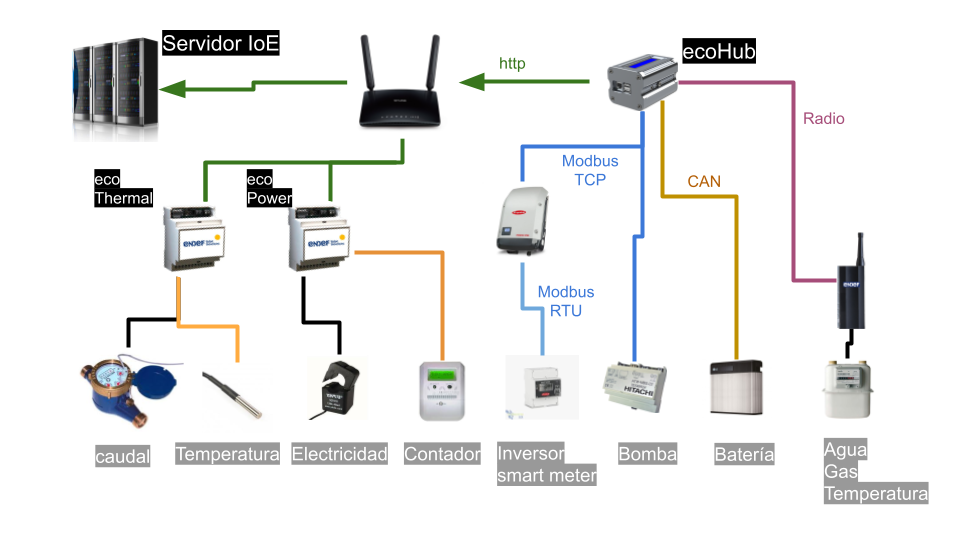

Arquitectura IoE
================
La arquitectura Internet de la Energía esta dividida en tres partes:

* La red de Radio a la que se conectan los dispositivos de bajo consumo alimentados con baterías
* La red de WIFI a las que se conectan los dispositivos de medida con un alto grado de procesamiento
* El servidor que recopila y muestra la información de los sensores

La red de Radio
---------------
La componen los dispositivos que alimentados a baterías necesitan una autonomía de varios años y el concentrador que recibe la información

Estos dispositivos están diseñados para un consumo mínimo de energía, requisito para el cual el método de transmisión más adecuado es la radio en la banda de 433Mhz. Estos equipos transmiten con un consumo de energía muy bajo, en periodos de tiempo muy cortos, a la vez que proporcionan una probada estabilidad.

Todos los dispositivos envían la información a ecoHub que recibe la información vía radio y la decodifica para reenviarla al servidor a través de Internet.
En una gran parte los casos, el servicio de ecoHub, está instalado sobre una Raspberry Pi

La red de WIFI
--------------

El servidor
-----------

