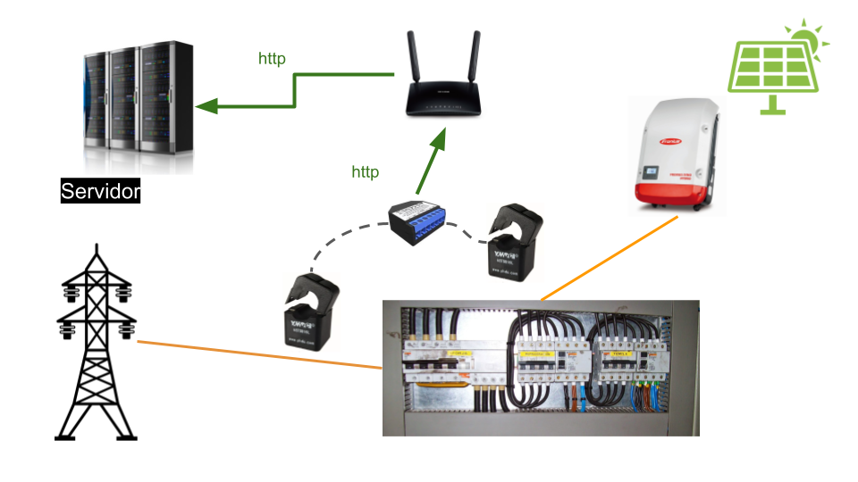

Autoconsumo
===========
Se presentan dos manera de medir el la energía en una instalación solar

* Con un analizador de redes
* Con un analizador y un ecoHub

Con un analizador de redes
--------------------------
Esta solución proporciona los datos principales de una instalación

Con un ecoHub
-------------
Esta configuración proporciona, además de los datos energéticos, el detalle del estado del inversor 

.. image:: ./imagenes/autoconsumo_modbus.png
