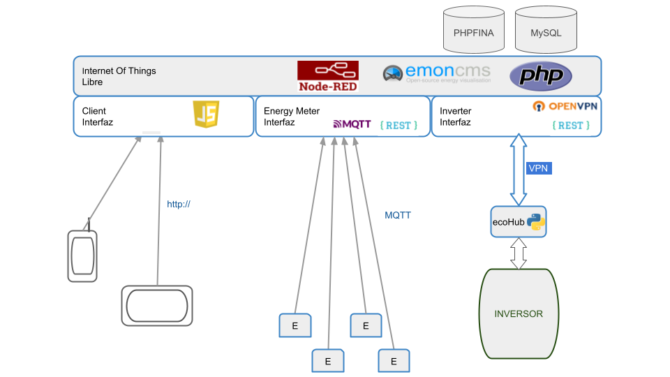
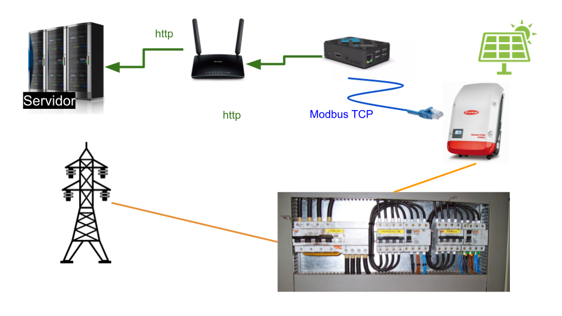
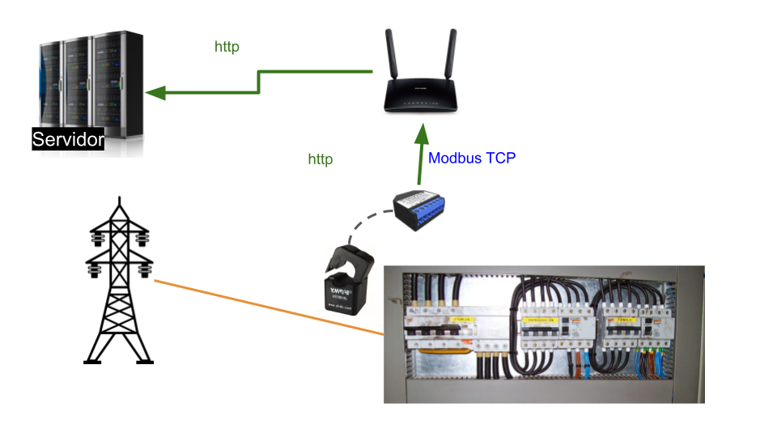

Comunidades Energéticas
========================
Introducción
------------
Este documento presenta una propuesta construida con software libre para la monitorización de los elementos que componen un autoconsumo compartido por una comunidad energética.

Todos los elementos que componen esta solución se han probado y comparado con otras soluciones de software libre de tal manera que lo que aquí se presenta el la mejor opción en cuanto a calidad y estabilidad.

El sistema es configurable y lo forman módulos tanto hardware como software de tal manera que se pueden sustituir por otros mas evolucionados, si se diera el caso.

Arquiectura
-----------
A continuación se presenta la arquitectura software de las comunidades energéticas

**emoncms:** Desrrollado por la comunidad de "Open Energy Monitor" es una referencia y este caso es el motor de la solución.

**PhP:** Es el lenguaje de programación con el que se ha desarrollado emoncms. Este lenguaje tiene un rendimiento muy alto para aplicaciones web.

**NodeRed:** Permite dar flexibilidad a la solución y que esta sea fácilmente configurable para evitar modificar el código fuente de la aplicación.

**JavaScript:** Las aplicaciones para móvil y para tablet funcionan con JavaScript para darle una funcionalidad dinámica incluso en entornos donde el ancho de banda es limitado.

**Medidores de Energía(E):** Son analizadores de redes con transformadores de intensidad (pinzas). Todas las maracas comerciales que cumplan con el protocolo MQTT son válidas. También pueden instalarse equipos de Open Energy Monitor que pueden integrarse de forma nativa

**OpenVPN:** La coneción al inversor se hace de forma segura mediante una VPN. Esta VPN también cumple el propósito de habilitar el acceso a la Raspberry para tareas de mantenimiento remoto.

**ecoHub:** Es el software para conectarse al inversor mediante MODBUS y enviar la información al servidor haciendo uso del API Rest del servidor. Desarrollado en Pytho, este software se instala en una Raspberry en la misma localización del inversor. 

Tipos de instalación
--------------------

Los valores de energía que genera el inversor se obtienen con el software ecoHub instalado en una Raspberry.

La energía consumida por el usuario se mide mediante un analizador de redes instalado en el cuadro del usuario.

