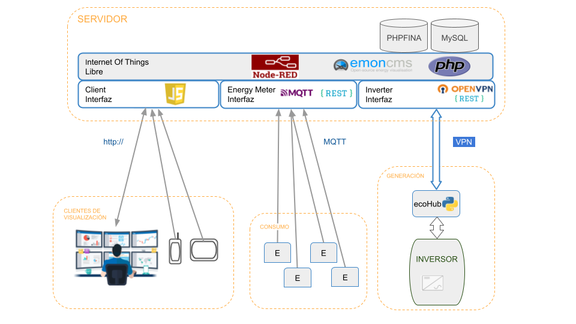
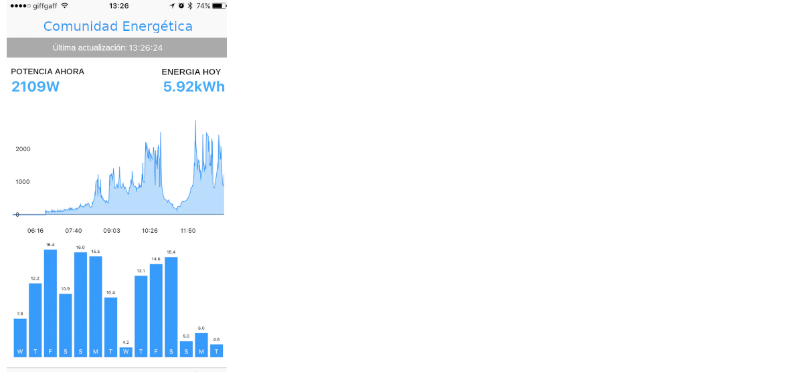

Propuesta tecnológica para las Comunidades Energéticas
======================================================
Introducción
------------
Esta propuesta, construida con software libre, toma como base los elementos diseñados en el Proyecto Internet de la Energía (IoE).

IoE para Comunidades esta diseñada para la monitorización de los elementos que componen un autoconsumo compartido de una comunidad energética. Todos los elementos que componen esta solución se han probado y comparado con otras soluciones, también de software libre, de tal manera que lo que aquí se presenta el la mejor opción en cuanto a calidad y estabilidad. Además, este servicio esta pensado para que el coste sea reducido, intentando que pueda asumirse, sin grandes esfuerzos, como parte de la instalación.

El sistema es configurable y esta formado módulos, tanto de hardware como de software, de tal manera que se pueden sustituir por otros mas evolucionados, si se diera el caso.

Arquitectura
-----------
La siguiente figura muestra un esquema funcional de todos los elementos que componen la aplicación.

Los partes principales que componen esta arquitectura son:

* El Servidor
* La medida del consumo
* La medida de la generación
* Los clientes de visualización

El servidor
-----------

Esta ubicado en internet y en el se centralizan tanto la monitorización como el control de todos los elementos que componen el Internet de la Energía (IoE). A continuación se describen los elementos que lo componen:

**emoncms:** Desarrollado por la comunidad de "Open Energy Monitor" es una referencia en el area de de la energía y en este caso es el motor de la solución. El software se pude encontrar en `Github <https://github.com/emoncms/emoncms/>`_

**PhP:** Es el lenguaje de programación con el que se ha desarrollado emoncms. Este lenguaje tiene un rendimiento muy alto para aplicaciones web. Página oficial de `pHp: <https://www.php.net/>`_

**NodeRed:** Permite dar flexibilidad a la solución y que esta sea fácilmente configurable para evitar modificar el código fuente de la aplicación. También esta basado en este módulo el control activo de los elementos como pueden ser los inversores, la carga de baterías o el control de carga del vehículo electrico. Página oficial de `NodeRed: <https://nodered.org/>`_

**JavaScript:** Las aplicaciones para móvil y para tableta funcionan con JavaScript para darle una funcionalidad dinámica incluso en entornos donde el ancho de banda es limitado. Página de `JavaScript <https://developer.mozilla.org/es/docs/Web/JavaScript/>`_ en Mozilla

**Logica de proceso** Cuando es necesario hacer cálculos de forma intensiva estos se desarrollan en `Python <http://www.python.org/>`_

La medida del consumo
---------------------

La energía consumida por el usuario se mide mediante un analizador de redes instalado en el cuadro eléctrico del edificio. La siguiente figura muestra un esquema simplificado de como se hace la conexión

.. image:: ./imagenes/medida_tansformador.png

**Medidores de Energía(E):** Son analizadores de redes con transformadores de intensidad (pinzas). Todas las maracas comerciales que cumplen con el protocolo MQTT son válidas. También pueden instalarse equipos de Open Energy Monitor que pueden integrarse de forma nativa.

Integración con Datadis
-----------------------
En las infraestructuras que cuentan con contadores de energía inteligentes la propia ditribuidora de electricidad recibe los datos de consumo (o generación) del propio contador. Estas distribuidoras ofrecen los datos a traves de una plataforma común a todas ellas: Datadis `Datadis: <https://datadis.es>`_

La integración de los datos, obtenidos mediante consultas a datadis se hace de dos formas diferentes:

* Tiempo real: Un programa consulta diariamente los datos disponibles y los incorpora al servidor IoE
* Historico anual de consumos: Un script consulta los datos anuales de un usuario y los procesa para grabarlos en una base de datos

En ambos casos los datos se tratan de igual manera que si procediesen de un medidor de energía.

La medida de la generación
--------------------------

Además de la instalación del software de servidor, que se debe hacer en un proveedor de servicios en Internet, es necesario instalar equipos tanto en los edificios donde se mide el consumo de energía como en las ubicaciones donde esta se genera:

Los valores de energía que genera el inversor se obtienen con el software ecoHub instalado en una Raspberry. La siguiente figura muestra un esquema simplificado de como se haría la conexión

.. image:: ./imagenes/medida_inversor.png

**ecoHub:** Es el software para conectarse al inversor mediante MODBUS y enviar la información al servidor haciendo uso del API Rest del servidor. Desarrollado en Python, este software se instala en una Raspberry en la misma localización del inversor. Software de `ecoHub en Github: <https://github.com/iotlibre/eco_modbus_tcp/>`_

**OpenVpn:** La conexión al inversor se hace de forma segura mediante una VPN. Esta VPN también cumple el propósito de habilitar el acceso a la Raspberry para tareas de mantenimiento remoto y control. En esta dirección se puede encontrar la pagina oficial de `OpenVpn: <https://openvpn.net/>`_

Los clientes de visualización
-----------------------------

Existen múltiples formas de ver la información de la instalación de autoconsumo. En esta imagen se puede ver la forma mas extendida de comparar la energía producida (en el porcentaje asignado al usuario) con la energía consumida:

Exixten varios formatos para los clientes de movíl. En la siguiete figura se puede ver un ejemplo:

Estas mismas imágenes se pueden ver representadas en una tableta:

**Los centros de control** Están pensado para centralizar todas las medidas de una comunidad energética y para, a través de las VPN, poder controlar todos sus elementos.

