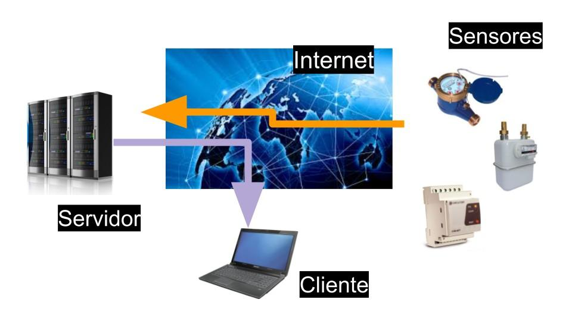
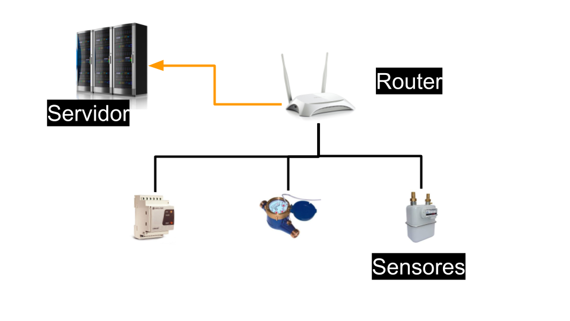

Descripción general del proyecto
================================
La solución tecnológica propuesta se apoya en los principios y tecnologías del Internet de las cosas. Esta solución consta de tres partes diferenciadas: los dispositivos que recogen la información, la transmisión de esta información a Internet y el procesado de los datos recibidos. La comunicación entre estas tres partes se hace mediante protocolos abiertos cuyo uso no esta condicionado al pago de derechos y la licencia del software, usado en el proyecto, esta aprobada por la Open Source Iniciative o por la Free Software Foundation.

En los siguientes apartados se describen cada una de las partes y las condiciones que han de cumplir

Los dispositivos que recogen la información
-------------------------------------------
La información del consumo de los edificios se recoge mediante diferentes tipos de sensores como pueden ser transformadores de intensidad, para la medida del consumo eléctrico, o generadores de pulsos ubicados en los contadores de agua o gas. Estos sensores se conectan a equipos electrónicos que son los traducen a medidas de consumo comprensibles como son kilovatios hora o litros. 

La información se transmite a Internet mediante un protocolo abierto que puede ser usado sin necesidad de compra de licencias ni pago de “royalties”. Ejemplo de estos protocolos son Restful o MQTT.

La especificación de los mensajes de este protocolo se presenta junto con el resto de documentación del proyecto para que pueda ser usado en futuras ampliaciones. El objetivo es que sea posible integrar nuevos dispositivos siempre y cuando estos puedan comunicarse con el servidor utilizando el protocolo acordado

La transmisión de la información
--------------------------------
Los dispositivos se comunican por WIFI a un router dedicado cuya única función es dar servicio a la red de datos de consumo y a cualquier otro sistema de sensores que pudiera ser instalado. Del router se envía a Internet usando la salida a internet del propio edificio o un modem 3G.

El servidor que recibe la información esta ubicado en Internet, en lo que llamamos la nube,  y recibe la información desde los edificios previstos en el proyecto y desde otros edificios, del término municipal, que a futuro quieran integrarse en el proyecto.

El procesado y la transmisión de los datos
------------------------------------------
El procesado de los datos se hace mediante de un proveedor de servicios en la nube.

El servidor de la nube esta únicamente dedicado a proyectos de educación ambiental y ahorro energético. No esta compartido con otras redes de sensores de tal manera que los responsables de su gestión pueden ampliarlo, limitar su acceso o incluir nuevas funcionalidades sin depender de terceros. Las capacidades del servidor son suficientes para la gestión de todos los datos originados en el proyecto.

La ampliación de las capacidades del servidor, en caso de que se incluyan nuevos edificios, se puede hacer de forma sencilla, mediante configuración, sin necesidad de ampliar el hardware que soporta el servidor
Los datos se presentarán en gráficas que reflejan el consumo diario, semanal o mensual de los recursos que se miden. Estas gráficas pueden combinar varias fuentes de datos para que puedan ser comparados y que permitan la creación de informes.

Los datos pueden ser exportados a una hoja de cálculo.

Se facilitará la integración con otros sistemas informáticos externos. El acceso a la plataforma desde otras aplicaciones, ya sean desde ayuntamientos u de otras entidades, se hace a través de servicios web.

El código fuente del software de este servidor se ha desarrollado bajo una licencia GPL v3.

