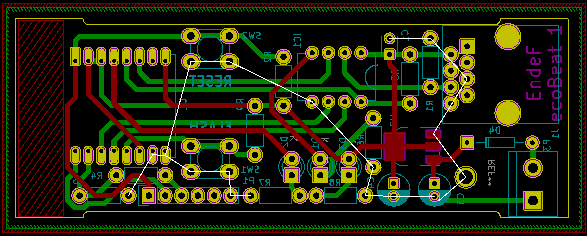

ecoBeat
========
EcoBeat es un dispositivo que mide el consumo de energía mediante pulsos. Estos pulsos se generan en dispositivos tales como contadores eléctricos, contadores de agua o contadores de gas. ecoBeat traduce los pulsos a las unidades correspondientes y los transmite vía WIFI a un servidor en Internet. Este dispositivo cumple con los estándares de Internet of Things y está especialmente diseñado para realizar mediciones de energía.

EcoBeat admite longitudes del cable de medida de hasta 20 metros por lo que no es necesario que se instale cerca del contador que se quiere monitorizar.

En un edificio podemos tener tantos dispositivos como sean necesarios y desde el servidor se visualizarán en la misma localización sin necesidad de configuraciones adicionales o cambiar parámetros en el Firmware.
La comunicación se hace mediante Wifi por lo que no es necesario el cableado de datos al equipo solamente es preciso que esté dentro de la cobertura de la red WIFI del edificio.

Para su uso no son necesarios conocimientos de informática, aunque todos los desarrollos y el hardware están hechos bajo licencias libres lo que permite la modificación y mejora de las funcionalidades.

Principales características
---------------------------
* 1 entrada de pulsos optica o mecánica
* Anulación de rebotes para pulsos mecánicos
* Anchura de los pulsos configurable de 0 a 100 ms
* Precisión en las medidas de pulsos: ± 0,1%
* Comunicación a Internet por WIFI local
* Configurable vía Web
* Estandard: IEEE 802.11 b/g/n
* Alimentación a 220 voltios de corriente alterna. Rango: 85 ~ 264VAC
* Montaje en carril din
* La PCB integra un Arduino nano con el ESP8266 12E
* Compatible con el servidor "Internet de la Energía”

Puesta a punto
--------------
La puesta a punto de EcoPower consta de dos partes:

 * La configuración en la instalación
 * El firmware de Arduino

La configuración en la instalación
~~~~~~~~~~~~~~~~~~~~~~~~~~~~~~~~~~
En este punto se definen los parámetros del servidor de destino y la WIFI local a la que va a estar conectado el dispositivo. 
Con este fin, la primera vez que se ponga en servicio el equipo el ESP 8266 12E creará su propio punto de acceso para su propia red WIFI. Conectándose a cualquier dirección, a través de este punto de acceso, nos aparecerá la página de configuración del ESP. Este procedimiento se pondrá en marcha también siempre que ecoBeat, no encuentre la WIFI configurada.
Téngase en cuenta que una vez configurado el ESP y conectado a una red WIFI el router le asignará una única dirección IP a la que será necesario acceder para cambiar la configuración.

En caso de que se quiera actualizar el firmware del ESP a la última versión, este se puede encontrar en el repositorio de código.

El firmware de Arduino
~~~~~~~~~~~~~~~~~~~~~~
El firmware que está cargado por defecto en el Arduino nano funciona correctamente para pulsos electrónicos y también mecánicos mayores de 40 milisegundos, si quiere cambiar la configuración puede encontrar la última actualización del firmware en este repositorio de código.

Código fuente
~~~~~~~~~~~~~
El código del firware y la documentación del harware se puede encontrar en este `repositorio <https://github.com/iotlibre/ecoBeat>`_

