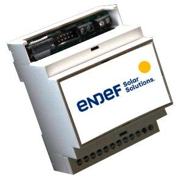

ecoPower
========
ecoPower está pensado para tomar las medidas de consumo eléctrico de una vivienda o de un edificio con consumos inferiores a 30 KW. El sistema permite diferenciar varias zonas.

ecoPower se puede instalar en el cuadro eléctrico principal o en cualquier otra parte que nos permita tomar datos del consumo mediante pinzas (transformadores de intensidad). En el un edificio podemos tener tantos dispositivos como sean necesarios y el servidor los integrará en la misma instalación sin necesidad de configuraciones adicionales o cambios en el Firmware. La comunicación se hace mediante Wifi por lo que no es necesario el cableado de datos al equipo solamente es preciso que esté dentro de la cobertura de la red WIFI del edificio.

Para su uso no son necesarios conocimientos de informática aunque todos los desarrollos y el hardware están hechos bajo licencias libres lo que permite la modificación y mejora de las funcionalidades.

Principales características
---------------------------
* 6 entradas para sensores de corriente con salida estandar de 50 mA
* 1 entrada de medida de voltage 200 - 440 Voltios
* Precisión en las medida de energía: ± 1,2%
* Comunicación a Internet por WIFI local
* Configurable vía Web
* Estandard: IEEE 802.11 b/g/n
* Alimentación a 220 voltios de corriente alterna. Rango: 85 ~ 264VAC
* Montaje en carril din
* La PCB integra un Arduino nano con el ESP8266 12E
* Compatible con el servidor IoE

Puesta a punto
--------------
La puesta a punto de EcoPower consta de dos partes:

* La configuración en la instalación
* El firmware de Arduino

La configuración en la instalación
~~~~~~~~~~~~~~~~~~~~~~~~~~~~~~~~~~
En este punto se definen los parámetros del servidor de destino y la wifi local a la que va a estar conectado el dispositivo. Con este fin, la primera vez que se ponga en servicio el ESP y siempre que no encuentre la WIFI configurada, el ESP 8266 12E creará su propio punto de acceso, su propia red WIFI . Conectandose a cualquier dirección a través de este punto de acceso nos aparecerá la página de configuración del ESP. Tengase en cuenta que una vez configurado el ESP y conectado a una red WIFI el router le asignará una única dirección IP a la que será necesario acceder para cambiar la configuración

El firmware de Arduino
~~~~~~~~~~~~~~~~~~~~~~
El firmware que que esta cargado por defecto en el arduino nano funciona correctamente para tranformadores de intensidad de 100A/50mA sin embargo, si quiere cambiar la configuración puede encontrar la última actualización del firmware en el repositorio

Código fuente
~~~~~~~~~~~~~
El código del firware y la documentación del harware se puede encontrar en `repositorio <https://github.com/iotlibre/EcoPower>`_

