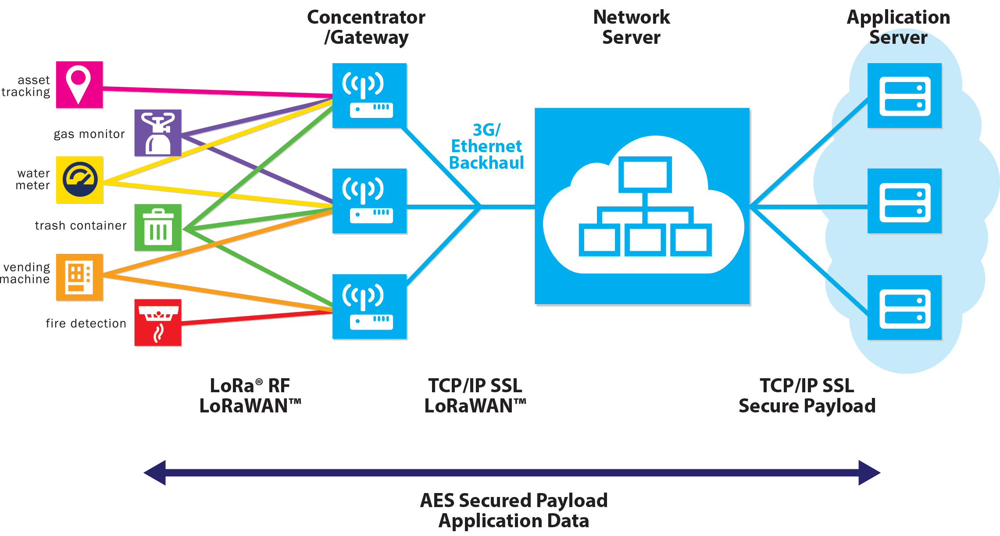

Ciudad inteligente y sostenible
===============================
El objetivo de una Ciudad Inteligente es disponer de una infraestructura de recogida visualización y análisis de los datos que de servicio a las empresas y a los ciudadadanos de un monicipio.

Al hablar de ciudad inteligente, en muchos casos, se asocia a futuro pero hoy en día, con el rápido
avance de las tecnologías abiertas, disponer de una infraestructura de medida y análisis, de última
generación, esta al alcance de cualquier entidad pública o privada.

Esta propuesta esta basada en dos líneas tecnológicas principales:

* Internet de las Cosas
* LoraWan

**Internet de las cosas** permite tomar medidas de cualquier sensor y subirlo a un servidor en la nube. Actualmente IoT se esta muy extendiendo por su **fiabilidad y bajo coste**.

**LoraWan** posibilita el transporte, por el aire (Wireless), de los datos a grandes distancias. Es posible alcanzar distancias de 10 Kms, y consumos de baterías muy bajos con autonomías de varios años.

Estas dos tecnologías unidas permiten disponer de plataformas inteligentes fiables y a un coste reducido tanto energético como presupuestario.

La siguiente figura muestra un esquema de los elementos que componen la red:

* **Sensores**: Reciben la información y la envían a un concentrador LoraWan.
* **Concentrador**: Recibe la información de los sensores, que se encuentran en su área de cobertura, y la trasmite al servidor.
* **Servidor de Red**: Recibe toda la información la clasifica y la envía al servicio que le corresponde.
* **Servidor de aplicaciones**: Puede compartir servidor con el network server. En este servidor residen las aplicaciones concretas como puede ser el control de riegos, seguimiento de ganado, parking y otras

Las ventajas
------------
Las Principales ventajas de utilizar este tipo de redes smart son las siguientes:

**Flexibilidad**. Los sensores se instalan sin cables ni alimentación.

**Robustez**. Las señales son recibidas desde varios puntos por lo que un fallo no interrumpe el servicio.

**Bajo consumo de energía**. Las comunicaciones LoraWan se han diseñado para que los sensores tengan un gasto mínimo de energia.

**Seguridad**. Los datos seguros propiedad del ayuntamiento. Los datos no estan gestionados por terceras empresas de servicios.

**Libre de costes mensuales**. Los sensores se comunican por el aire en frecuencias que estan libres de coste.

Con una **rápida amortización**.

Posibles aplicaciones
---------------------
Los sensores LoraWan se están utilizando actualmente en multitud de áreas. Algunas de ellas son:

* Medida de la confortabilidad de viviendas: Temperatura, Huemdad, CO2 
* Media de consumos energéticos
* Medida de consumo de agua
* Agricultura sostenible
* Domótica
* Automatización industrial
* Control medioambiental, Calidad del agua, Calidad del aire
* Control de edificios

    
    
    
